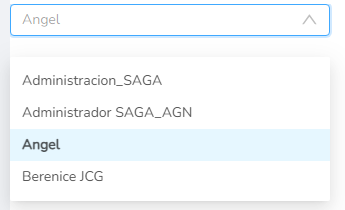
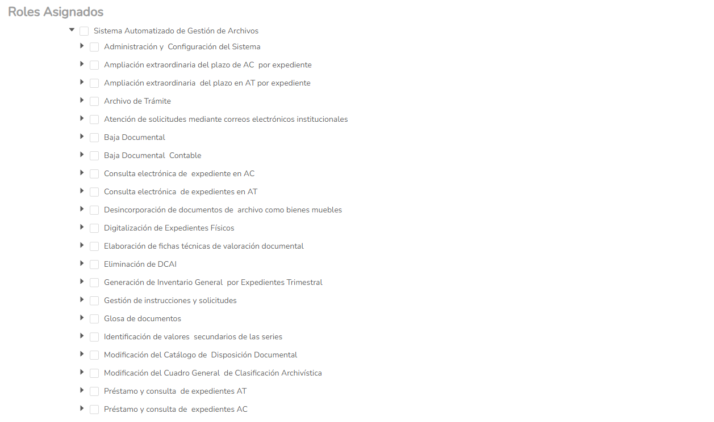
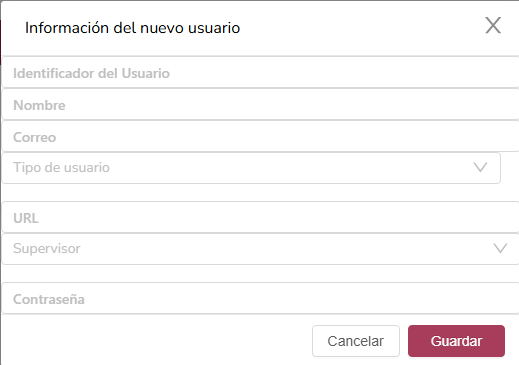
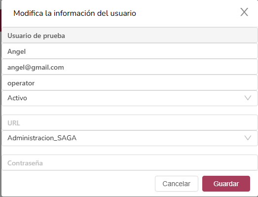
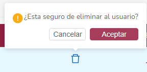
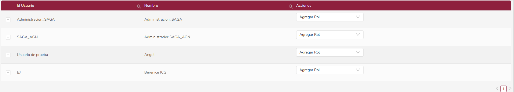
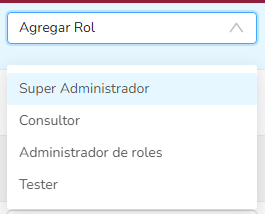

# Evaluación de sistema
## SAGA (Sistema automatizado de gestión de archivo)

### Objetivo:
Consulta, alta y baja de expedientes y documentos del archivo.

### Público objetivo:
Empleados

## Análisis funcional, qué se puede hacer?
### Administrador

https://sagaip.sfa.michoacan.gob.mx/roles
- Listar los usuarios disponibles

- Asignar roles a usuarios

https://sagaip.sfa.michoacan.gob.mx/users

- Crear usuarios

-Editar usuarios

- Eliminar usuarios

https://sagaip.sfa.michoacan.gob.mx/usersSystemRoles

- Se listan todos los usuarios en el sistema y se les puede asignar un rol "administrativo" dentro del sistema

### Ciudadano
