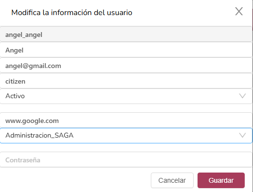
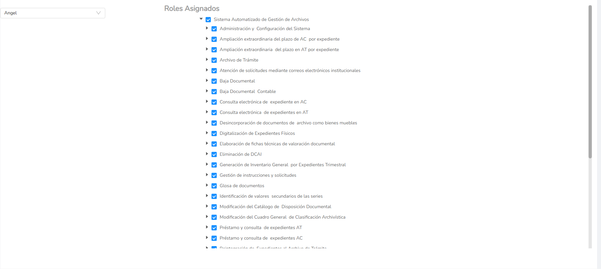
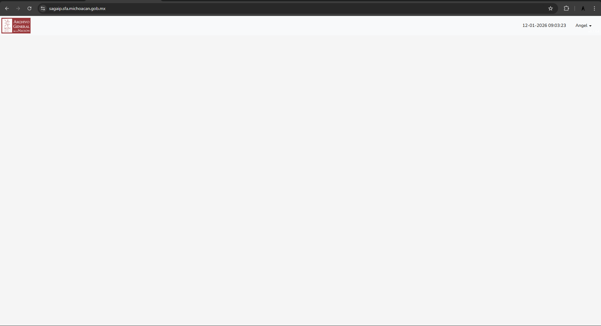
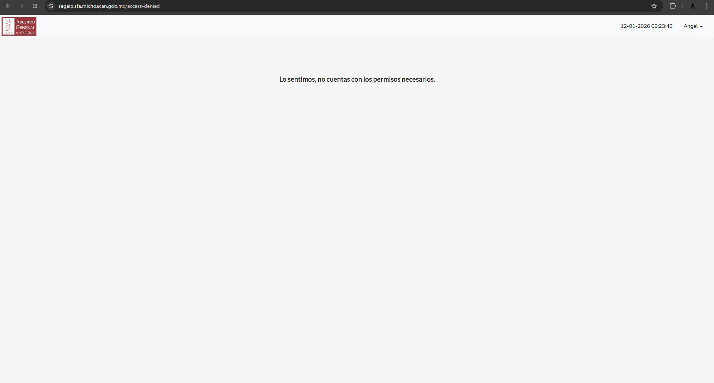
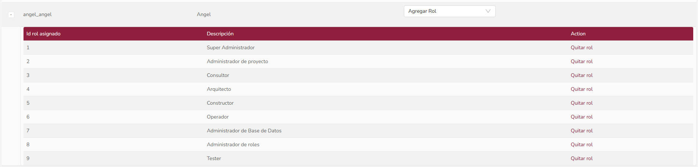

# Evaluación de sistema
## SAGA (Sistema automatizado de gestión de archivo)

### Objetivo:
Consulta, alta y baja de expedientes y documentos del archivo.

### Público objetivo:
Empleados

## Análisis funcional, qué se puede hacer? ✅
### Administrador

https://sagaip.sfa.michoacan.gob.mx/roles
- Listar los usuarios disponibles

- Asignar roles a usuarios

https://sagaip.sfa.michoacan.gob.mx/users

- Crear usuarios

-Editar usuarios

- Eliminar usuarios

https://sagaip.sfa.michoacan.gob.mx/usersSystemRoles

- Se listan todos los usuarios en el sistema y se les puede asignar un rol "administrativo" dentro del sistema

## qué no se puede hacer? ❌
- Navegar por el escritorio virtual
- Consulta de archivo
- 

### Errores
La principal limitante es la imposibilidad de navegar a través del escritorio virtual con culquier rol, sea del sistema o no.

### Rol: Ciudadano
- Se creó un usuario con los siguientes datos:

Se asignaron todos los roles:

- Al hacer login con el usuario la pagina no muestra nada y no se puede navegar

- Intentar navegar desde la barra de busqueda hasta el endpoint /virtuaDesktop tampoco funciona

- Todos los roles de administrador de sistema asignados:

